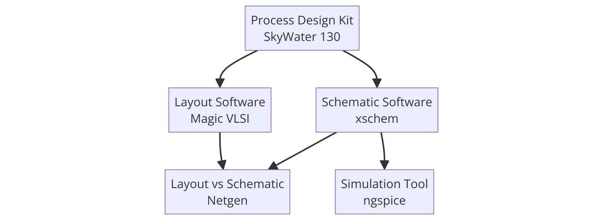

## Process for installing


Steps for installing

Various software packages and data packages are nesecarry to create our own 
analog cirucit designs. In this tutorial we are going to install 2 graphical programs (Xschem & Magic VLSI)
1 simulator program (nGspice), 1 data package (Skywater PDK 130) and 1 program that veirfies part of our design (Ngnet).





### Installing Xschem

### Installing Magic

### Installing Ng Spice

### Installing Nnet


### Installing the GAW
although not mentioned in the original tutorial, you will also probably have to install GAW to run simulations


### Installing the PDK
```bash
git clone git://opencircuitdesign.com/open_pdks
cd open_pdks
```
Now that you have copied the directory run each line separately
```bash
./configure --enable-sky130-pdk
```
```
make
```
```
sudo make install
```

